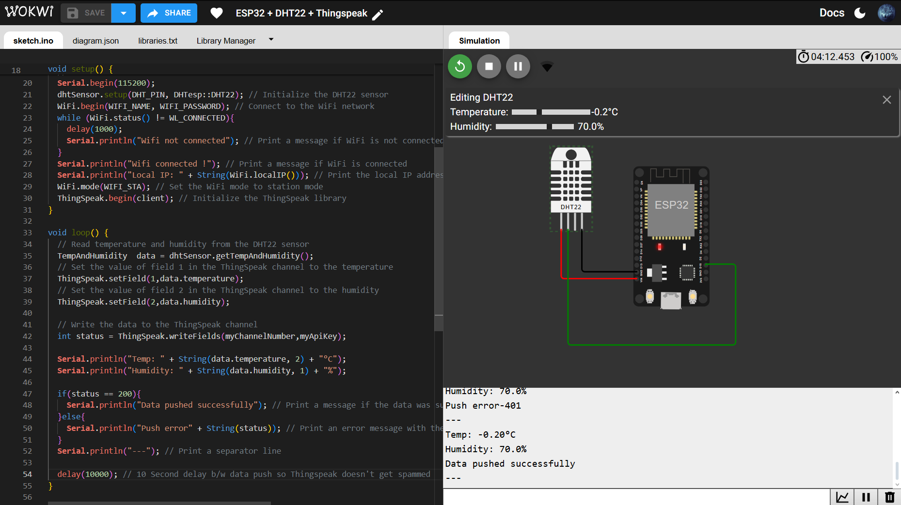
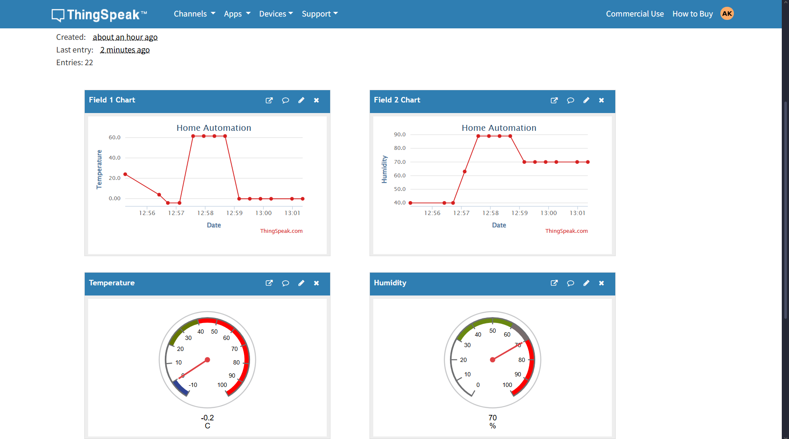

# 🌡️ Temperature & Humidity Real-Time Monitoring using ESP32 + DHT22 + ThingSpeak

Monitor temperature and humidity data in real-time using an ESP32 microcontroller and a DHT22 sensor. The data is pushed to a cloud dashboard using ThingSpeak, enabling remote visualization and threshold-based alerting.

---

## 📡 System Architecture

```

DHT22 Sensor → ESP32 (via GPIO) → WiFi → ThingSpeak (Cloud Dashboard)

````

---

## 🧰 Hardware Components

| Component        | Quantity |
|------------------|----------|
| ESP32 Devkit V1  | 1        |
| DHT22 Sensor     | 1        |

---

### 🔌 Circuit Diagram


## 🔌 Circuit Schematic (Wokwi)

| DHT22 Pin | Connects To |
|-----------|-------------|
| VCC       | VIN on ESP32 |
| GND       | GND on ESP32 |
| Data      | GPIO 15 on ESP32 |

> ✅ You can simulate this in [Wokwi](https://wokwi.com) using the included `diagram.json`.

---

## 📦 Required Libraries

Install the following libraries in Arduino IDE:

- `DHTesp`
- `ThingSpeak`
- `WiFi.h` (default in ESP32 board package)

**Install via:**
> Tools → Manage Libraries → Search and install each one

---

## 💻 Code Overview

```cpp
// Read sensor data
TempAndHumidity data = dhtSensor.getTempAndHumidity();
ThingSpeak.setField(1, data.temperature);
ThingSpeak.setField(2, data.humidity);

// Upload to ThingSpeak
ThingSpeak.writeFields(myChannelNumber, myApiKey);
````

---

## 🚀 How to Run the Project

1. Open the project in Arduino IDE
2. Select board: `ESP32 Dev Module`
3. Connect your ESP32 via USB/ Run the simulation on Wokwi(if no Hardware is present)
4. Paste the code from `sketch.ino`
5. Install required libraries
6. Enter your ThingSpeak API key & channel number
7. Upload and open Serial Monitor at 115200 baud
8. Observe live data updates every 10 seconds

---

## 📊 ThingSpeak Dashboard

> View real-time data at your ThingSpeak channel URL:

```
https://thingspeak.com/channels/your-channel-id
```

### 📈 Sample Output:



---

## 📝 Author

**Aditya Raj Kar**
IoT Enthusiast | Computer Science Student
[GitHub](https://github.com/TRITUSLegend) · [LinkedIn](https://www.linkedin.com/in/adityarajkar/)

---
